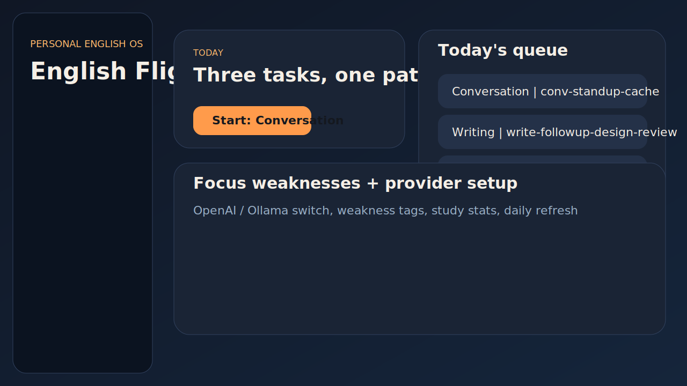
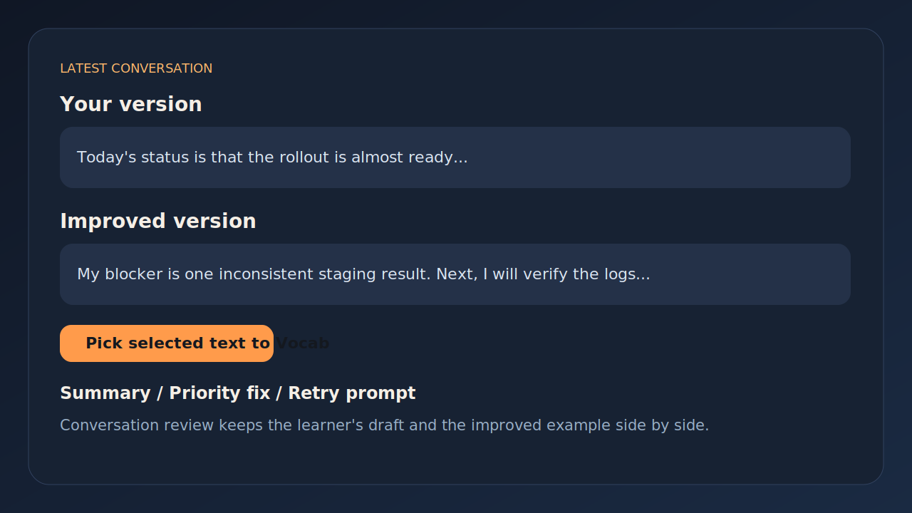
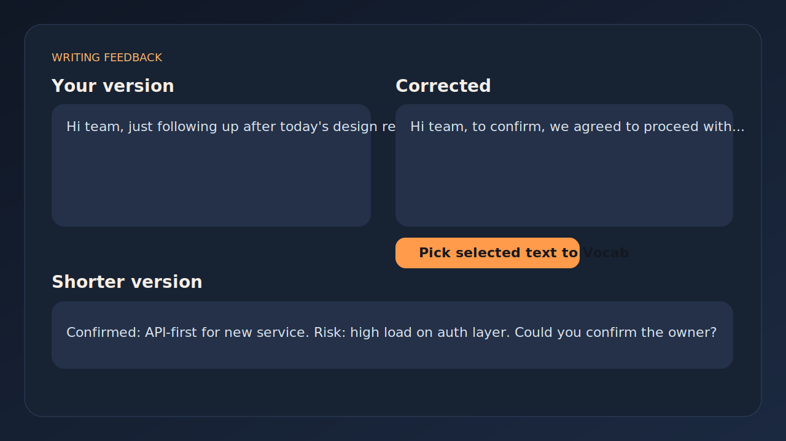
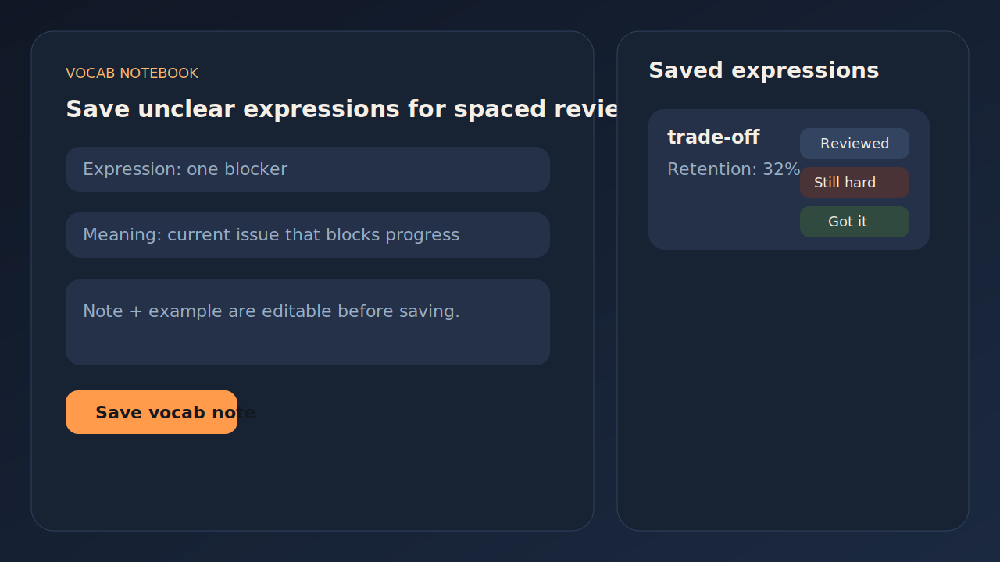

# naIEng

`naIEng` は、`nab` 個人向けに作っている、ソフトウェアエンジニア向け実務英語トレーニングアプリです。

使用技術:

- `Tauri`
- `Rust`
- `React`
- `TypeScript`
- `SQLite`

毎日の学習導線は、できるだけ迷わず次の3つを回すことを前提にしています。

- 会話ドリルを1本
- ライティングドリルを1本
- 単語・表現の復習を回す

## スクリーンショット

### Home



### Conversation Review



### Writing Review



### Vocab Notebook



## 現在の機能

### Daily学習フロー

- `50本` のシナリオ stock から daily task を生成
- 毎日 `conversation`、`writing`、`srs` を1本ずつ持つ
- `Refresh Daily` を押すと、その日の課題を未出シナリオ優先で差し替える
- 同じ日の中では、できるだけ同じ `scenario_id` を避ける
- 候補を使い切った場合は再利用する

### Conversation Drill

- テキスト入力ベースの会話練習
- OpenAI または Ollama で評価可能
- API が失敗した場合は local fallback で最低限の評価を返す
- Review では次を表示:
  - `Your version`
  - `Improved version`
  - `Summary`
  - `Priority fix`
  - `Retry prompt`
- 会話履歴を保存
- 同じ `scenario_id` に対する繰り返し挑戦を追跡

### Writing Drill

- ビジネスメールや短い実務文章の練習
- OpenAI または Ollama で評価可能
- API が失敗した場合は local fallback で最低限の評価を返す
- Review では次を表示:
  - `Your version`
  - `Corrected`
  - `Shorter version`
  - `Summary`
- ライティング履歴を保存
- 同じ `scenario_id` に対する繰り返し挑戦を追跡

### Vocab Notebook

- わからなかった単語や表現を手動で登録できる
- 初期データとして次の表現を収録:
  - `one blocker`
  - `next action`
  - `trade-off`
- 各カードには次の操作がある:
  - `Reviewed`
  - `Still hard`
  - `Got it`
  - `Delete`
- 各カードに定着率スコアを持たせている
- 並び順は次から選べる:
  - 定着率の低い順
  - 定着率の高い順
  - 最近復習した順

### Review から Vocab へ語句を送る

- Conversation Review の `Improved version` から、必要な語句だけ選択して Vocab に送れる
- Writing Review の `Corrected` や `Shorter version` からも、必要な語句だけ選択して Vocab に送れる
- 選択した文字列は `Vocab` 画面の `Expression` に入る
- そのため、全文がそのまま単語帳に入ることを防げる

### 進捗の見える化

- Recent writing sessions
- Recent conversation sessions
- `scenario_id` ごとの進捗
- Weakness tags
- 学習時間
- Writing 平均スコア
- Speaking 平均スコア

## AI Provider 設定

対応している provider:

- `OpenAI`
- `Ollama`

### OpenAI

OpenAI の API key は **アプリ内に保存しません**。

起動前に、現在の PowerShell セッションで環境変数を設定してください。

```powershell
$env:OPENAI_API_KEY="your_api_key"
```

### Ollama

ローカル Ollama サーバーを使えます。例:

- `mistral:latest`
- `llama3:latest`
- `gemma3:4b`

既定の base URL:

```text
http://127.0.0.1:11434
```

## 起動方法

```powershell
cd S:\tools\codex\naIEng
npm.cmd run tauri:dev
```

## ビルド確認

```powershell
cd S:\tools\codex\naIEng\src-tauri
cargo check
```

```powershell
cd S:\tools\codex\naIEng
npm.cmd run build
```

## 補足

- 会話は現状、音声録音ではなく transcript 入力方式
- `Refresh Daily` は、その日の課題を新しいシナリオに差し替え、再び pending に戻す
- 個人利用前提で作っており、マルチユーザー運用は前提にしていない

## 今後の改善候補

- 音声録音 + ASR による会話入力
- AIフィードバックからのワンクリック表現抽出
- 単語帳の spaced repetition 強化
- シナリオ別の時系列推移の詳細表示
- さらに細かい phrase-level coaching
